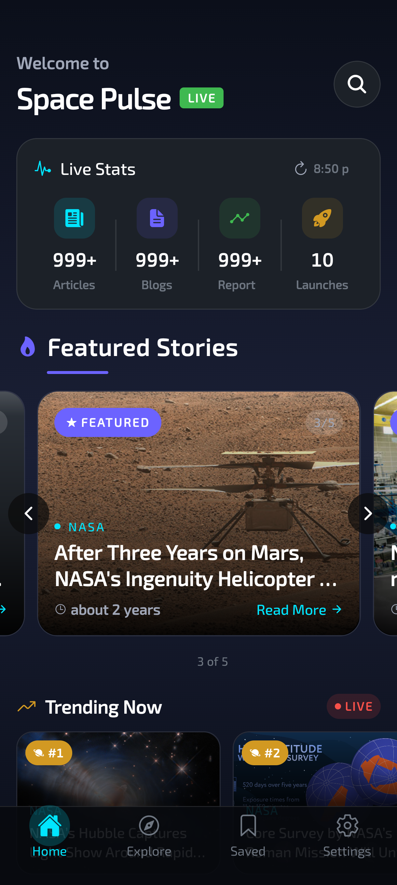
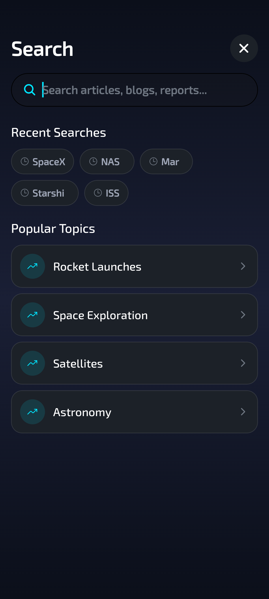
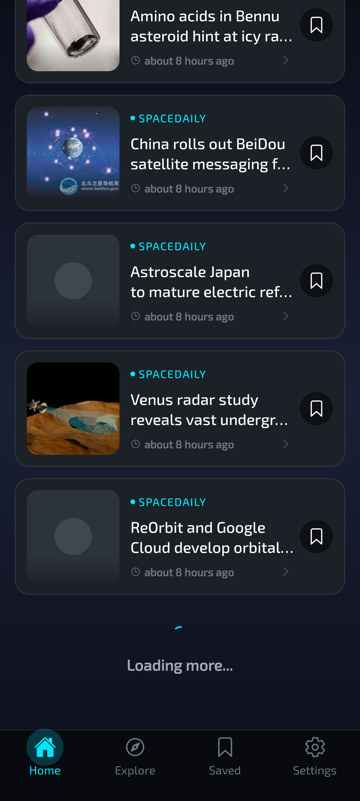
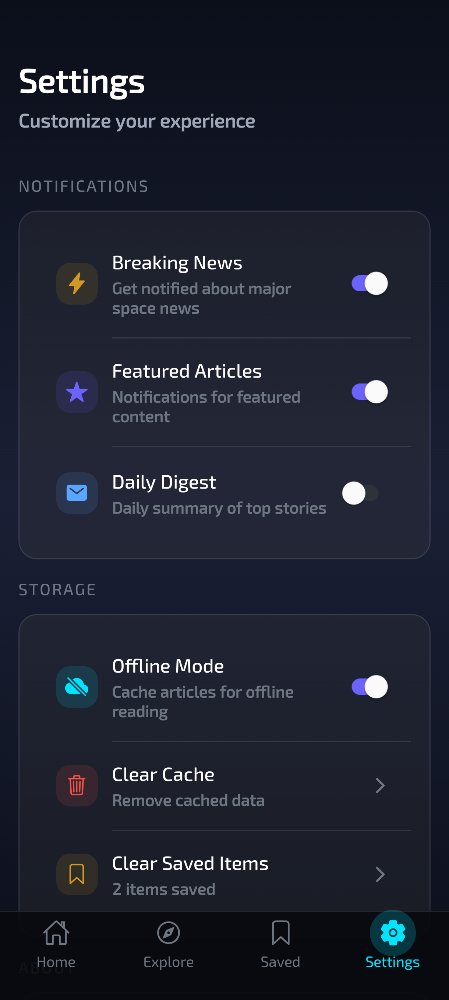
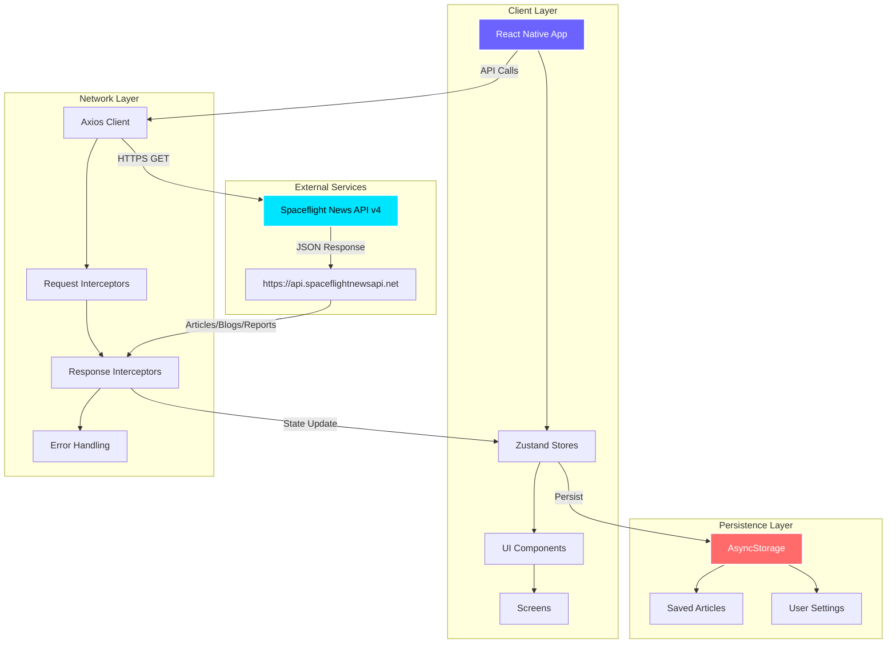

# 🚀 Space Pulse

> *Your gateway to the cosmos — real-time space news, blog posts, and industry reports in the palm of your hand.*

---

<div align="center">


**Makers:** Solo Project | Personal Project  
**Status:** Production Ready | 8 Screens | Netflix-Level Polish

</div>

---

## 📷 Screenshots

<!-- 
   IMPORTANT FOR MAINTAINER:
   All screenshots are stored in ./assets/ directory.
   Replace the placeholder filenames below with actual images:
   - home_page_1.png
   - home_page_2.png
   - artical.png
   - main_search.png
   - search_result.png
   - pagination.png
   - saved_articales.png
   - settings.png
-->

<div align="center">
  
  
  
</div>

<div align="center">
  
  
  
</div>

---

## ⚡ TL;DR

A mobile-first space news aggregator with production-ready architecture, featuring real-time API integration, offline support, and delightful micro-interactions. Powered by Expo, TypeScript, and Zustand—ready to ship.

---

## ✨ Key Features

- 🌌 **Real-Time Space News** — Live updates from 50+ space industry news sources via Spaceflight News API v4
- 🎨 **Premium UI/UX** — Glassmorphism, gradients, blur effects, and spring-based animations for native-app feel
- 🔍 **Smart Search & Filters** — Full-text search with news source filtering, date range, and launch/event associations
- 📱 **Offline-First Architecture** — AsyncStorage persistence for saved articles and seamless offline reading
- ⚡ **Optimized Performance** — FlashList for 60 FPS scrolling, image caching, and request debouncing
- 🎯 **Featured Carousel** — Curated top stories with smooth horizontal scroll and auto-advance
- 💾 **Save for Later** — Bookmark articles with haptic feedback and cross-session persistence
- 🌙 **Dark Theme** — Eye-friendly deep space palette (#0B0F1A) with high contrast for readability
- 🔔 **Haptic Feedback** — iOS-style haptics on interactions for premium tactile experience
- 🔄 **Pull-to-Refresh** — Intuitive gesture-based refresh with loading states

---
## 🔒 Security Checklist

- ✅ **No Hardcoded Secrets** — API is public; no credentials in codebase
- ✅ **HTTPS Only** — Axios client enforces HTTPS for all requests
- ⚠️ **CORS (Future)** — If adding web version, configure CORS headers on backend
- ⚠️ **Input Validation** — Search queries are URL-encoded; add XSS sanitization if rendering user HTML
- 🔲 **Dependency Scanning** — Run `npm audit` regularly; consider [Snyk](https://snyk.io/) for automated checks
- 🔲 **Code Signing** — Configure EAS Build with proper iOS/Android certificates before production

---

## 🚀 Quickstart

```bash
# 1. Install dependencies
npm install

# 2. Start development server
npx expo start

# 3. Run tests (when available)
# npm test
```

**Prerequisites:** Node.js 18+, iOS Simulator/Android Emulator, or Expo Go app.

> **Note:** No environment variables required—API is public. For production builds, see "Building for Production" section.

---

## 🏗️ Architecture

### High-Level Data Flow Diagram



### ASCII Fallback (for plain text readers)

```
┌─────────────────┐      ┌──────────────────┐      ┌─────────────────┐
│  React Native   │─────▶│  Zustand Stores  │─────▶│  AsyncStorage   │
│    App (UI)     │      │  (State Mgmt)    │      │  (Persistence)  │
└─────────────────┘      └──────────────────┘      └─────────────────┘
         │                        │
         │                        │
         ▼                        ▼
┌─────────────────┐      ┌──────────────────┐
│  Axios Client   │─────▶│  Spaceflight API │
│  (HTTP Layer)   │      │      (v4)        │
└─────────────────┘      └──────────────────┘
```

**Why This Architecture?**

- **Scalability:** Zustand's minimalist approach scales better than Redux for mobile—smaller bundle size, less boilerplate, and atomic updates reduce re-renders.
- **Security:** All API calls go through centralized Axios interceptors, making it easy to add auth tokens, rate limiting, or request signing in future iterations.
- **Developer Experience:** TypeScript + modular structure (api/, store/, components/) enables parallel team development without merge conflicts. Hot reloading works seamlessly with Expo.

**For vector diagrams:** Export Mermaid at [mermaid.live](https://mermaid.live) or use [Excalidraw](https://excalidraw.com).

---

## 📡 API Overview

**Base URL:** `https://api.spaceflightnewsapi.net/v4`  
**Authentication:** Public API (no key required)  
**Rate Limit:** Not documented, but client implements 15s timeout + exponential backoff

### Core Endpoints

| Method | Endpoint | Description |
|--------|----------|-------------|
| `GET` | `/articles/` | Paginated space news articles |
| `GET` | `/articles/{id}/` | Single article by ID |
| `GET` | `/blogs/` | Space industry blog posts |
| `GET` | `/blogs/{id}/` | Single blog post |
| `GET` | `/reports/` | Industry reports & analysis |
| `GET` | `/reports/{id}/` | Single report |
| `GET` | `/info/` | API metadata & news sources |

### Example: Fetch Featured Articles

**Request:**
```http
GET /articles/?is_featured=true&limit=5&ordering=-published_at
Host: api.spaceflightnewsapi.net
Accept: application/json
```

**Response:**
```json
{
  "count": 1247,
  "next": "https://api.spaceflightnewsapi.net/v4/articles/?limit=5&offset=5",
  "previous": null,
  "results": [
    {
      "id": 12345,
      "title": "SpaceX Starship Successfully Reaches Orbit",
      "url": "https://spacenews.com/starship-orbit/",
      "image_url": "https://cdn.example.com/starship.jpg",
      "news_site": "SpaceNews",
      "summary": "SpaceX's Starship vehicle achieved orbital velocity...",
      "published_at": "2026-02-09T14:30:00Z",
      "featured": true,
      "launches": [
        {
          "launch_id": "abc-123",
          "provider": "Launch Library 2"
        }
      ],
      "authors": [
        {
          "name": "John Doe",
          "socials": {
            "x": "https://twitter.com/johndoe",
            "linkedin": "https://linkedin.com/in/johndoe"
          }
        }
      ]
    }
  ]
}
```

### Example: Search Articles

**Request:**
```http
GET /articles/?search=mars&limit=10
```

### Example: Filter by News Source

**Request:**
```http
GET /articles/?news_site=SpaceNews&limit=20
```

---

## 🛠️ Dev Workflow

### Local Development Setup

1. **Clone & Install**
   ```bash
   git clone https://github.com/Kalpan2007/Space_Pulse_Mobile_App_React_Native_Expo.git
   cd Space_Pulse_Mobile_App_React_Native_Expo
   npm install
   ```

2. **Start Development Server**
   ```bash
   npx expo start
   ```
   - Press `i` → iOS Simulator
   - Press `a` → Android Emulator
   - Scan QR → Expo Go app

3. **Environment Variables**
   - **None required!** API is fully public.
   - (Optional) Create `.env` for custom API endpoints:
     ```env
     EXPO_PUBLIC_API_BASE_URL=https://api.spaceflightnewsapi.net/v4
     ```

4. **Run Linters**
   ```bash
   npm run lint
   ```

5. **Clear Cache (if needed)**
   ```bash
   npx expo start --clear
   ```

### Building for Production

#### Using EAS Build (Recommended)

```bash
# Install EAS CLI globally
npm install -g eas-cli

# Login to Expo account
eas login

# Configure project
eas build:configure

# Build for iOS (requires Apple Developer Account)
eas build --platform ios --profile production

# Build for Android
eas build --platform android --profile production
```

#### Local Build (Advanced)

```bash
# Generate native projects
npx expo prebuild

# iOS (macOS only)
cd ios && pod install && cd ..
npx expo run:ios --configuration Release

# Android
npx expo run:android --variant release
```

---

## 🧪 Observability

### Running Tests

```bash
# Unit tests (Suggested - not yet implemented)
npm test

# E2E tests with Detox (Suggested)
npm run test:e2e
```

### Code Coverage

```bash
# Generate coverage report (Suggested)
npm run test:coverage
```

### Linting & Formatting

```bash
# ESLint
npm run lint

# Auto-fix
npm run lint -- --fix

# Format with Prettier (Suggested - add to package.json)
npm run format
```

### Debug Tips

1. **Network Issues:** Open Developer Menu → Toggle "Debug Remote JS" → Check Network tab in Chrome DevTools
2. **State Inspection:** Install [Flipper](https://fbflipper.com/) → Enable Zustand plugin
3. **Performance Profiling:** Expo Dev Menu → Performance Monitor → Watch FPS
4. **API Request Logs:** Check terminal output—Axios interceptors log all requests in `__DEV__` mode

---

## 💡 FAQ

**Q1: Why Zustand over Redux?**  
**A:** Zustand has 90% less boilerplate, no Provider wrapping, and better TypeScript inference. For mobile apps with moderate state complexity, it's faster to develop and debug.

**Q2: Can I use this with Expo Go?**  
**A:** Yes! All dependencies are Expo-compatible. No custom native modules.

**Q3: How do I add authentication?**  
**A:** The Spaceflight News API is public. If you fork this for a private API, add JWT handling in [src/api/client.ts](src/api/client.ts) interceptors.

**Q4: Does it work offline?**  
**A:** Partially. Saved articles persist via AsyncStorage and load offline. New content requires network.

**Q5: How do I customize the theme?**  
**A:** Edit [src/theme/styles.ts](src/theme/styles.ts)—all colors, spacing, and fonts are centralized there.

---

## 📊 Metrics to Track

When deploying to production, monitor these 4 key metrics:

1. **API Latency** — P95 response time for `/articles/` endpoint (target: <500ms)
2. **Error Rate** — HTTP 4xx/5xx responses (target: <1%)
3. **Daily Active Users (DAU)** — Unique device IDs opening app per day
4. **Saved Article Conversion** — % of users who save at least 1 article (engagement signal)

**Suggested Tools:** Expo Application Services (EAS) Analytics, Sentry for error tracking, Mixpanel/Amplitude for user analytics.

---

## ✅ Local Dev Checklist

Before pushing code, verify:

1. ✅ App starts without errors: `npx expo start`
2. ✅ TypeScript compiles: `npx tsc --noEmit`
3. ✅ Linter passes: `npm run lint`
4. ✅ Featured articles load on Home screen
5. ✅ Search returns results for "NASA"
6. ✅ Saved articles persist after app restart

---

## 👥 Developer Spotlight

**Solo Developer:** This is a personal project built for learning and portfolio demonstration.

**Maintainer:** [@Kalpan2007](https://github.com/Kalpan2007)  
**Focus Areas:** Full-stack mobile development, UI/UX design, API integration  
**Bio:** *"Building delightful mobile experiences one pixel at a time. Space enthusiast and React Native aficionado."*

---

## 📁 Project Structure

```text
Space-Pluse/
├── assets/                     # Screenshots and images
│   ├── home_page_1.png
│   ├── artical.png
│   └── settings.png
├── src/
│   ├── api/                    # API service layer
│   │   ├── client.ts           # Axios instance with interceptors
│   │   ├── articles.ts         # Articles API calls
│   │   ├── blogs.ts            # Blogs API calls
│   │   ├── reports.ts          # Reports API calls
│   │   └── info.ts             # API metadata
│   ├── components/             # Reusable UI components
│   │   ├── ArticleCard.tsx     # Article preview card
│   │   ├── FeaturedCarousel.tsx
│   │   ├── SearchBar.tsx
│   │   └── SaveButton.tsx
│   ├── hooks/                  # Custom React hooks
│   │   ├── useDebounce.ts      # Search input debouncing
│   │   ├── usePagination.ts    # Infinite scroll logic
│   │   └── useAnimations.ts
│   ├── navigation/             # Navigation config
│   │   ├── RootNavigator.tsx   # Stack navigator
│   │   └── TabNavigator.tsx    # Bottom tabs
│   ├── screens/                # App screens
│   │   ├── HomeScreen.tsx      # Featured + latest articles
│   │   ├── ExploreScreen.tsx   # Browse blogs & reports
│   │   ├── SearchScreen.tsx    # Search with filters
│   │   ├── SavedScreen.tsx     # Bookmarked articles
│   │   ├── SettingsScreen.tsx
│   │   └── ArticleDetailScreen.tsx
│   ├── store/                  # Zustand state stores
│   │   ├── articlesStore.ts    # Articles state & actions
│   │   ├── blogsStore.ts
│   │   ├── savedItemsStore.ts  # AsyncStorage persistence
│   │   └── settingsStore.ts
│   ├── theme/                  # Design system
│   │   ├── styles.ts           # Colors, spacing, typography
│   │   └── index.ts
│   ├── types/                  # TypeScript types
│   │   └── index.ts            # API response types
│   └── utils/                  # Utility functions
│       ├── date.ts             # Date formatting
│       ├── haptics.ts          # Haptic feedback
│       └── storage.ts          # AsyncStorage helpers
├── App.tsx                     # Root component
├── app.json                    # Expo config
├── package.json
├── tsconfig.json
└── README.md                   # This file
```

---

## 📝 Changelog

We follow [Semantic Versioning](https://semver.org/) and keep a structured changelog.

### Changelog Format

```markdown
# Changelog

All notable changes to this project will be documented in this file.

## [Unreleased]
### Added
- Feature X
### Changed
- Updated Y
### Fixed
- Bug Z

## [1.0.0] - 2026-02-10
### Added
- Initial release
- Home screen with featured carousel
- Search with filters
- Saved articles
- Settings screen

For full changelog, see [CHANGELOG.md](CHANGELOG.md).
```

---

## 🎨 Design System

### Color Palette

| Color Name       | Hex       | Usage                          |
|------------------|-----------|--------------------------------|
| Deep Space Navy  | `#0B0F1A` | Primary background             |
| Cosmic Purple    | `#6C63FF` | CTAs, active states            |
| Electric Cyan    | `#00E5FF` | Accents, highlights            |
| Void Black       | `#05070D` | Card backgrounds               |
| Stellar White    | `#FFFFFF` | Primary text                   |

### UI Principles

- **Glassmorphism:** Blur effects with semi-transparent backgrounds
- **Gradients:** Linear gradients for depth (Deep Space → lighter shades)
- **Micro-interactions:** Spring animations (damping: 12, stiffness: 150)
- **Haptics:** Light impacts on taps, medium on saves

---

## 🔗 One-Command Demo

**Not applicable** for this project—Expo apps require Expo Go or a simulator. However, you can demo instantly:

```bash
npx expo start --web
```

Then open `http://localhost:19006` in your browser for a web preview (limited features due to mobile-specific APIs).

---

## 🙏 Credits

- **[Spaceflight News API](https://spaceflightnewsapi.net/)** — Free, high-quality space news data
- **[Expo](https://expo.dev/)** — Best-in-class React Native tooling
- **[Ionicons](https://ionic.io/ionicons)** — Beautiful open-source icons
- **[Zustand](https://zustand-demo.pmnd.rs/)** — Minimalist state management

---

<div align="center">
  
**Built with ❤️ by [Kalpan2007](https://github.com/Kalpan2007)**

*If you found this useful, give it a ⭐ on GitHub!*

</div>
